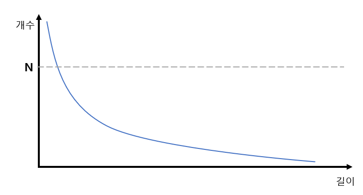
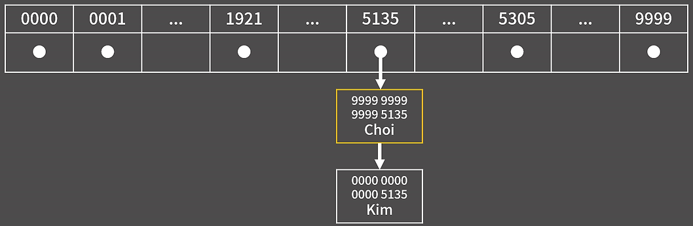

# Intro
----
# Basic
----
### 1. 시간복잡도
#####  O(1) < O(logN) < O(N) < O(NlogN) < O(n^2^) < O(2^N^) < O(N!)
#####  1초에 약 1억

### 2. 자료형
* 정수형
  * **char**        (1byte) : 27 -1  (255)
  * **short**       (2byte) : 215 -1 (32767)
  * **int**         (4byte) : 231 -1 (2.1x109)
  * **long long**   (8byte) : 263 -1 (9.2x1018)

* 실수형
  * **float**  : 지수(8), 수(23)
  * **double** : 지수(11), 수(52)
 
  double에 long long 범위를 지정할 수 없음.
 
  오차가 필연적이므로 double을 쓰는게 낫다.

### 3. 함수 인자
함수에 값을 넘겨줄 때 주소를 넘겨주지 않는 한 값이 복사되어 넘어가므로 함수에서 값을 바꿔도 이전 함수의 값이 변하지 않음.

만약 함수에서 값을 바꾸고 싶다면 Reference(**&**) 사용.
 ex. void swap(int &a, int &b)

# STL
----
### 1. Algorithm
  * **sort** : 기본 오름차순 정렬 (작은 것부터 순서대로) > 세번째 인자에 함수를 넣어 원하는 규칙대로 정렬 가능
    * 배열 : sort(arr, arr + 크기)
    * 벡터 : sort(v.begin(), v.end())
   
  * **binary_search** : 이분탐색(O(logN))으로 target의 존재 여부를 알 수 있음 > 존재하면 True, 존재하지 않으면 False  [주의: 오름차순 정렬 되어있어야 함]
    
    #### $\rightarrow\$ 원리 : st = begin(), en = end(), mid = st+en/2 라고 할 때
    
      > 1. target < mid 라면 en = mid -1
    
      > 2. target > mid 라면 st = mid +1
    
      > 3. en < st 면 target이 존재하지 않음
    
    * binary_search(begin(), end(), target) : target 값의 존재 여부를 알 수 있음
    * uppper_bound(begin(), end(), target) : target 값을 초과하는 최초의 주소를 반환
    * lower_bound(begin(), end(), target) : target 값이 최초 등장하는 주소를 반환 (만약 target이 존재하지 않으면 target을 초과하는 값이 최초 등장하는 주소 즉, upper_bound와 동일)
      
      $\rightarrow\$ upper와 lower를 이용하여 target의 개수(upper - lower) 및 오름차순을 유지하며 target을 삽입할 위치를 알 수 있음

    * unique : 중복 제거 함수로 v.erase(unique(v.begin(), v.end())를 하면 vector 내에 중복 원소를 지워준다 (이도 마찬가지로 오름차순 정렬이 필수)

      $\rightarrow\$ 본래 unique만 사용하면 중복을 없애고 남은 원소를 0번 index 부터 채운 후 남은 공간엔 쓰레기 값이 들어가 쓰레기 값이 시작되는 iter를 반환해 주지만, erase를 사용해 쓰레기 값을 삭제해 주는 것임

### 2. String
  * **lenght** : 문자열의 길이를 반환 > a.lenght();
    
### 3. Map
  * **map** : 왼쪽 값을 Key로, 오른쪽 값을 Value로 사용함 > 트리 형태로 탐색속도 높임 (Key를 기준으로 정렬)
    * 선언 : map<key, value> m;
    * 대입 : m.insert(make_pair('C', 2)); OR m['C'] = 2; (key가 char형, value가 int형 이라 가정하고 예시)
    * 원소 삭제 : m.erase(key);
    * 전체 삭제 : m.clear();
    * value 탐색 : m.find(key); > 존재 시 iterator를 반환, 없으면 m.end() 반환
    * key 탐색 : m.count(key); > 존재하면 1, 아니면 0
    * 기타 : size, empty() 있음
   
### 4. set
  * **unordered_set <type> name** : 해시 테이블로 구현되어있으며 정렬되어있지 않음(원소의 크기 혹은 삽입 순서로도 들어있지 않다) 대신 O(1), 또한 중복이 허용되지 않음
  * 삽입: name.insert(a) -> 이미 중복된 값이 있을 경우 아무 일도 일어나지 않음
  * 삭제: name.erase(a) -> 인자을 입력으로 줬을 때 해당 인자가 내부에 존재하면 삭제 후 1을 반환, 그렇지 않으면 0을 반환
  * 탐색: name.find(a) -> 입력 인자가 있다면 iterator를 반환, 그렇지 않으면 name.end()를 반환
  * 카운트: name.count(a) -> 입력 인자가 몇개 들어있는지 해당 함수는 중복을 허락하지 않으므로 존재하면 1, 존재하지 않으면 0 반환

  * **unordered_multiset <type> name** : 위의 unordered_set과 거의 동일하지만 중복을 허용함
  * 삭제: name.erase(a) -> 입력 인자 a의 값이 모두 삭제됨 (주의)

     -> 원소를 하나만 지우고 싶다면 name.erase(name.find(a))를 해야 하나의 iter만 반환하므로 하나만 지워짐

  * **unordered_map<type(key), type(vlaue)> name** : 키에 대응되는 값을 찾아줌
  * 주의: 만약 name["helloword"] = 1 인 경우에 name["helloword"] = 10을 하게 되면 새로운 ("helloword", 10)이 추가되는게 아닌 기존에 있던 것에 값을 덮어 쓰게 됨

# Subject
----
### 0x09 BFS
벽을 한번만 부순다거나 하는 제약 조건이 있는 상황에서의 탐색은 배열을 통해 풀이

ex) int arr[2][100][100] 이라는 3차원 배열을 만들고 조건 실행 유무, x좌표, y좌표로 저장 ([Beakjoon/BFS/2206.cpp](https://github.com/cho-hm02123/Algorithm_Study/blob/main/Beakjoon/BFS/2206.cpp))

### 0x13 이분탐색
#### Parametric Search
조건을 만족하는 최소/최댓값을 구하는 문제(최적화 문제)를 결정 문제로 변환해 이분 탐색을 수행할 수 있다.

ex) BOJ [랜선 자르기](https://github.com/cho-hm02123/Algorithm_Study/blob/main/Beakjoon/%EC%9D%B4%EB%B6%84%ED%83%90%EC%83%89/1654.cpp), [과자 나눠주기](https://github.com/cho-hm02123/Algorithm_Study/blob/main/Beakjoon/%EC%9D%B4%EB%B6%84%ED%83%90%EC%83%89/16401.cpp) 문제와 같이 X를 정했을 때 Y가 정해지는 문제는 Parametric Search를 이용해 풀 수 있다.

**주의** 그래프 개형이 증가/감소 해야함 증감을 하며 Y가 여러 개일 경우 불가능

### 0x15 해시
Key에 대응되는 값을 저장하는 자료 구조로 임의의 길이의 데이터를 고정된 길이의 데이터(해시)로 대응시킴 (충돌이 없을 때 insert, erase, find, update 모두 O(1))

ex) 16자리의 카드 번호 전체를 보는 것이 아닌 뒤 네자리만 봄

주의 사항 : 서로 다른 key가 같은 해시 값을 가지게 될 경우 충돌이 발생

해결방안: 해당 인덱스에 연결 리스트를 추가(chaining) OR 다음 칸에 저장(open addressing) -> STL은 Chaining 방식

 _출처 : BaaaaaaaarkingDog [실전 알고리즘] 0x15강 해시 ppt 16_
