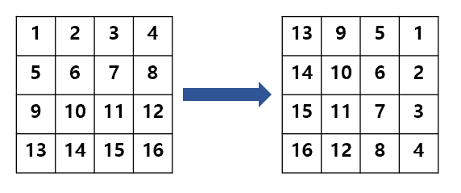
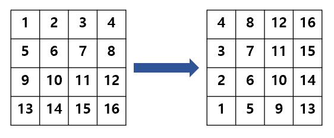
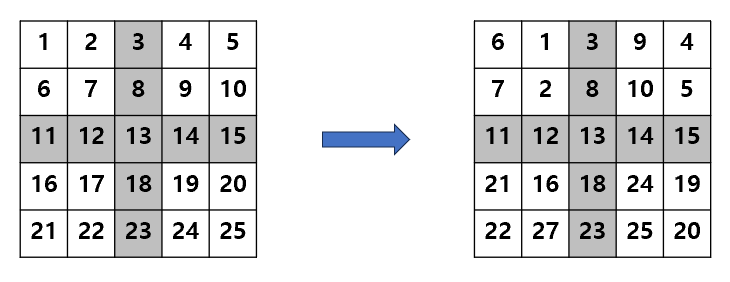
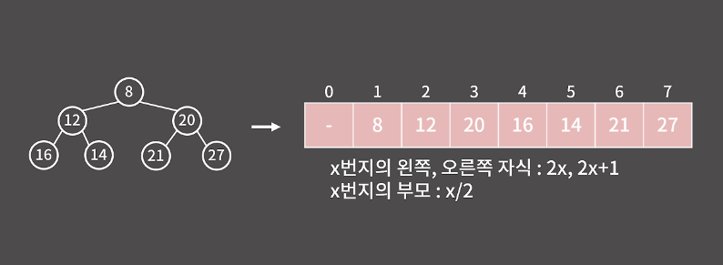

# Intro
----
# Basic
----
### 1. 시간복잡도
#####  O(1) < O(logN) < O(N) < O(NlogN) < O(n<sup>2</sup> ) < O(2<sup>N</sup> ) < O(N!)
#####  1초에 약 1억

### 2. 자료형
* 정수형
  * **char**        (1byte) : 2<sup>7</sup> -1  (255)
  * **short**       (2byte) : 2<sup>15</sup> -1 (32767)
  * **int**         (4byte) : 2<sup>31</sup> -1 (2.1x10<sup>9</sup>)
  * **long long**   (8byte) : 2<sup>63</sup> -1 (9.2x10<sup>18</sup>)

* 실수형
  * **float**  : 지수(8), 수(23)
  * **double** : 지수(11), 수(52)
 
  double에 long long 범위를 지정할 수 없음.
 
  오차가 필연적이므로 double을 쓰는게 낫다.

### 3. 메모리
위의 자료형 크기를 참고하여 메모리를 계산 (메모리를 초과하려 통과가 안되는 경우가 있으므로 128MB ~ 256MB 문제는 한번 계산해보기)

#### 1) 배열
int arr[n]의 경우 4byte * n = 4nbyte
 
#### 2) 구조체

```cpp
struct examplemem{
int x, y;
har idx;
}
 ```
 int가 2개 char가 1개 이므로 4byte * 2 + 1byte * 1 = 9byte

#### 3) 최적화
여러 타입이 들어가는 구조체를 선언할 때 위처럼 메모리 크기의 합만큼 메모리를 차지하는 것이 아닌 구조체 멤버 중 크기가 가장 큰 자료형의 크기에 맞춰 메모리가 할당됨. -> 따라서 위의 예시는 4byte * 3 = 12byte

 이때 만약 구조체 멤버의 선언을 int x; char idx; int y; 로 하였다면 실제 메모리 공간에서 구조체를 정렬할 때 공간이 남아 **'패딩'** 이 발생함
 따라서 자료형이 큰 type을 순서로 선언을 해주는 것이 좋다.

### 4. 함수 인자
함수에 값을 넘겨줄 때 주소를 넘겨주지 않는 한 값이 복사되어 넘어가므로 함수에서 값을 바꿔도 이전 함수의 값이 변하지 않음.

#### 1) Call by Value
함수가 인수로 부터 전달받은 값을 복사하여 처리 -> 함수 내에서 값을 변경해도 원본 값이 변하지 않음

2차원 배열의 경우 포인터를 넘기므로 Call by Value로 전달이 안됨 이를 해결하기 위해 2차원 벡터를 사용

```cpp
#include <vector>
#include <iostream>
using namespace std;
void func(vector<vector<int> >v){ //call by value
	v[0][1] = 20;
	return ;
}
int main(){
	vector<vector<int> > v;
	vector<int> tmp = {1,2,3,4,5};
	v.push_back(tmp);
	func(v);
	cout<<v[0][1]<<"\n";
    //print 2
}
```

#### 2) Call by Reference
만약 함수에서 값을 바꾸고 싶다면 Reference(**&**) 사용.
 ex. void swap(int &a, int &b)

### 5. 소수점
소수점 자리 조절 방법

cout << fixed; cout.precision(n); -> 소수점 n 자리까지 표현 (소수점 n+1 자리를 반올림 맨 뒤가 0이라도 0까지 나옴)

cout.unsetf(ios::fixed); -> fixed 고정 풀기

ex) Softeer [성적평균](https://github.com/cho-hm02123/Algorithm_Study/blob/main/Softeer/Lv3/%EC%84%B1%EC%A0%81%ED%8F%89%EA%B7%A0.cpp)

### 6. 시계, 반시계
  #### 1) 시계
   배열의 크기가 4x4인 2차원 배열을 시계방향으로 돌릴 시 [0][0] -> [0][4] , [1][2] -> [2][2] 으로 변하는걸 볼 수 있음 즉 [i][j] -> [j][n-i-1]이 됨

  ```cpp
void TurnCW(){
 int arr[n][n], tmp_arr[n][n];
 for(int i = 0; i < n; i++)
   for(int j = 0; j < n; j++)
     arr[j][n-i-1] = tmp[i][j];
}
```


  #### 2) 반시계
   배열의 크기가 4x4인 2차원 배열을 시계방향으로 돌릴 시 [0][0] -> [3][0] , [1][2] -> [1][1] 으로 변하는걸 볼 수 있음 즉 [i][j] -> [n-j-1][i]이 됨

```cpp
void TurnCCW(){
 int arr[n][n], tmp_arr[n][n];
 for(int i = 0; i < n; i++)
   for(int j = 0; j < n; j++)
     arr[n-j-1][i] = tmp[i][j];
}
```


  #### 3) 특정구간 회전
   배열의 크기가 nxn인 2차원 배열의 특정 구간을 회전시킬 경우 기준점(회전하고자 하는 사각형의 좌측 상단)을 더해준다.
  
   ex) BOJ [마법사 상어와 파이어스톰](https://github.com/cho-hm02123/Algorithm_Study/blob/main/Beakjoon/A/20058.cpp)

```cpp
void TurnStrdCW(int y1, int x1){
 int arr[n][n], tmp_arr[n][n];
 for(int i = 0; i < n; i++)
   for(int j = 0; j < n; j++)
     arr[j+y1][n-i+x1-1] = tmp[i+y1][j+x1];
}
int main(){
 int mid = n/2;
 TurnStrdCW(0,0);  //  좌상
 TurnStrdCW(0,mid+1);  //  우상
 TurnStrdCW(mid+1,0);  //  좌하
 TurnStrdCW(mid+1,mid+1);  //  우하
}
```


# STL
----
### 1. Algorithm
  * **sort** : 기본 오름차순 정렬 (작은 것부터 순서대로) > 세번째 인자에 함수를 넣어 원하는 규칙대로 정렬 가능
    * 배열 : sort(arr, arr + 크기)
    * 벡터 : sort(v.begin(), v.end())
   
  * **binary_search** : 이분탐색(O(logN))으로 target의 존재 여부를 알 수 있음 > 존재하면 True, 존재하지 않으면 False  [주의: 오름차순 정렬 되어있어야 함]
    
    #### $\rightarrow\$ 원리 : st = begin(), en = end(), mid = (st+en+1)/2 라고 할 때
    
      > 1. target < mid 라면 en = mid -1
    
      > 2. target > mid 라면 st = mid
    
      > 3. en < st 면 target이 존재하지 않음
    
    * binary_search(begin(), end(), target) : target 값의 존재 여부를 알 수 있음
    * uppper_bound(begin(), end(), target) : target 값을 초과하는 최초의 주소를 반환
    * lower_bound(begin(), end(), target) : target 값이 최초 등장하는 주소를 반환 (만약 target이 존재하지 않으면 target을 초과하는 값이 최초 등장하는 주소 즉, upper_bound와 동일)
      
      $\rightarrow\$ upper와 lower를 이용하여 target의 개수(upper - lower) 및 오름차순을 유지하며 target을 삽입할 위치를 알 수 있음

    * unique : 중복 제거 함수로 v.erase(unique(v.begin(), v.end()), v.end())를 하면 vector 내에 중복 원소를 지워준다 (이도 마찬가지로 오름차순 정렬이 필수)

      $\rightarrow\$ 본래 unique만 사용하면 중복을 없애고 남은 원소를 0번 index 부터 채운 후 남은 공간엔 쓰레기 값이 들어가 쓰레기 값이 시작되는 iter를 반환해 주지만, erase를 사용해 쓰레기 값을 삭제해 주는 것임

### 2. String
  * **lenght** : 문자열의 길이를 반환 > a.lenght();
    
### 3. Map
  * **map** : 왼쪽 값을 Key로, 오른쪽 값을 Value로 사용함 > 트리 형태로 탐색속도 높임 (Key를 기준으로 정렬)
    * 선언 : map<key, value> m;
    * 대입 : m.insert(make_pair('C', 2)); OR m['C'] = 2; (key가 char형, value가 int형 이라 가정하고 예시)
    * 원소 삭제 : m.erase(key);
    * 전체 삭제 : m.clear();
    * value 탐색 : m.find(key); > 존재 시 iterator를 반환, 없으면 m.end() 반환
    * key 탐색 : m.count(key); > 존재하면 1, 아니면 0
    * 기타 : size, empty() 있음
   
### 4. unordered_set
  * **unordered_set <type> name** : 해시 테이블로 구현되어있으며 정렬되어있지 않음(원소의 크기 혹은 삽입 순서로도 들어있지 않다) 대신 O(1), 또한 중복이 허용되지 않음
  * 삽입: name.insert(a) -> 이미 중복된 값이 있을 경우 아무 일도 일어나지 않음
  * 삭제: name.erase(a) -> 인자을 입력으로 줬을 때 해당 인자가 내부에 존재하면 삭제 후 1을 반환, 그렇지 않으면 0을 반환
  * 탐색: name.find(a) -> 입력 인자가 있다면 iterator를 반환, 그렇지 않으면 name.end()를 반환
  * 카운트: name.count(a) -> 입력 인자가 몇개 들어있는지 해당 함수는 중복을 허락하지 않으므로 존재하면 1, 존재하지 않으면 0 반환

  * **unordered_multiset <type> name** : 위의 unordered_set과 거의 동일하지만 중복을 허용함
  * 삭제: name.erase(a) -> 입력 인자 a의 값이 모두 삭제됨 (주의)

     -> 원소를 하나만 지우고 싶다면 name.erase(name.find(a))를 해야 하나의 iter만 반환하므로 하나만 지워짐

### 5. unordered_map
  * **unordered_map<type(key), type(vlaue)> name** : 키에 대응되는 값을 찾아줌
  * 주의: 만약 name["helloword"] = 1 인 경우에 name["helloword"] = 10을 하게 되면 새로운 ("helloword", 10)이 추가되는게 아닌 기존에 있던 것에 값을 덮어 쓰게 됨


# Subject
----
### 0x09 BFS
벽을 한번만 부순다거나 하는 제약 조건이 있는 상황에서의 탐색은 배열을 통해 풀이

ex) int arr[2][100][100] 이라는 3차원 배열을 만들고 조건 실행 유무, x좌표, y좌표로 저장 ([Beakjoon/BFS/2206.cpp](https://github.com/cho-hm02123/Algorithm_Study/blob/main/Beakjoon/BFS/2206.cpp))

### 0x13 이분탐색
#### Parametric Search
조건을 만족하는 최소/최댓값을 구하는 문제(최적화 문제)를 결정 문제로 변환해 이분 탐색을 수행할 수 있다.

ex) BOJ [랜선 자르기](https://github.com/cho-hm02123/Algorithm_Study/blob/main/Beakjoon/%EC%9D%B4%EB%B6%84%ED%83%90%EC%83%89/1654.cpp), [과자 나눠주기](https://github.com/cho-hm02123/Algorithm_Study/blob/main/Beakjoon/%EC%9D%B4%EB%B6%84%ED%83%90%EC%83%89/16401.cpp) 문제와 같이 X를 정했을 때 Y가 정해지는 문제는 Parametric Search를 이용해 풀 수 있다.

**주의** 그래프 개형이 증가/감소 해야함 증감을 하며 Y가 여러 개일 경우 불가능 

### 0x15 해시
Key에 대응되는 값을 저장하는 자료 구조로 임의의 길이의 데이터를 고정된 길이의 데이터(해시)로 대응시킴 (충돌이 없을 때 insert, erase, find, update 모두 O(1))

ex) 16자리의 카드 번호 전체를 보는 것이 아닌 뒤 네자리만 봄

주의 사항 : 서로 다른 key가 같은 해시 값을 가지게 될 경우 충돌이 발생

해결방안: 해당 인덱스에 연결 리스트를 추가(chaining) OR 다음 칸에 저장(open addressing) -> STL은 Chaining 방식

 _출처 : BaaaaaaaarkingDog [실전 알고리즘] 0x15강 해시 ppt 16_

**해시를 이용해 dfs 탐색 방법** [BOJ 20166 - 문자열 지옥에 빠진 호석](Beakjoon/해시/20166.cpp)

### 0x16 이진검색트리
#### 개념
정점/노드: 각 원소

루트: 트리의 가장 꼭데기

리프: 가장 밑단

간선: 정점을 연결하는 선

트리의 높이: 루트에서 리프까지의 높이 (시작을 0으로 두는지 1로 두는지에 따라 차이 발생)

서브트리: 어떠한 정점에 대해 그 밑에 있는 정점과 간선만을 모은 것

이진트리: 각 노드의 자식이 2개 이하인 트리

#### 구현
X번지의 왼쪽, 오른쪽 자식은 각각 2X, 2X+1번지 이고 X번지의 부모는 X/2번지 이다.

이진 검색 트리: 왼쪽 서브트리의 모든 값은 부모보다 작고, 오른쪽 서브 트리의 오든 값은 부모보다 큰 이진 트리
 _출처 : BaaaaaaaarkingDog [실전 알고리즘] 0x17강 우선순위큐 ppt 26_


STL로는 set, multiset, map 사용 (insert, erase, find, update 모두 O(logN)에 처리 가능 단, N이 100만 같이 크고 시간이 1초 정도이면 간당간당함)

-> 원소가 크기순으로 정렬되어 해시보다 좋음

### 0x18 그래프
그래프: 정점과 간선으로만 이루어진 자료 구조

차수: 정점에서 뻗어 나간 정점의 수

그래프의 간선에는 방향이 존재할 수 있다.

	outdegree: 정점에서 나가는 간선

	indegree: 정점에서 들어오는 간선

 사이클: 임의의 한 점에서 시작해 자신으로 돌아오는 것 (사이클이 하나라도 있으면 순환 그래프)

 완전 그래프: 모든 서로 다른 정점이 간선으로 연결된 그래프

 연결 그래프: 임의의 두 정점 사이의 경로가 항상 존재

 #### 표현법
 #### 1) 인접행렬
 두 정점 사이의 간선이 하나 이하일 때 사용 O(v<sup>2</sup> )

 ex) 방향 그래프 arr[1][2] = 1; 이면 이건 정점 2 -> 정점 3인 그래프

 #### 2) 인접 리스트
 정점이 많고 간선이 적을 때 사용 O(V+E)

 v개의 리스트를 만들어 자신과 연결된 정점을 저장

 ex) v[2] = {1, 3, 4}; 이면 2번 정점은 1, 3, 4번 정점와 연결되어 있음

### 0x19 트리
트리의 성질: 무방향이면서 사이클이 없는 연결 그래프 (v개의 정점을 가지고 v-1개의 간선을 가짐)

#### 순회


### 0x1A 위상정렬
위상정렬: 그래프에서 간선으로 주어진 정점 간 선후관계를 위배하지 않도록 나열하는 정렬

-> 때문에 사이클이 존재하면 안됨

#### 구현
	1. 모든 간선에 대해 inderee 조사
 	2. indegree가 0인 정점을 모두 큐에 넣음 (indegree가 0이라는 것은 가장 선위라는 것)
  	3. 큐에서 정점을 꺼내 위상 정렬 결과에 추가
   	4. 3번의 outdegree와 연결된 정점의 indegree 수를 1 감소시킴
    5. 4의 정점 중 indegree가 0인 정점을 큐에 추가
    6. 3 ~ 5의 과정을 큐가 빌 때 까지 반복

### 0x1B 최소 신장 트리
신장 트리: 주어진 방향성이 없는 그래프의 부분 그래프들 중 모든 정점을 포함하는 트리 (연결되지 않은 정점이 없어야 하며 사이클이 존재하면 안됨)

최소 신장 트리: 신장 트리 중 간선의 합이 최소인 트리

#### 알고리즘
#### 1) 크루스칼 알고리즘

#### 2) 프림 알고리즘
우선순위 큐를 이용해 구현

	1. 임의의 정점을 선택해 최소 신장 트리에 추가
 	2. 최소 신장 트리에 포함된 정점과 최소 신장 트리에 포함되지 않은 정점을 연결하는 간선 중 비용이 가장 작은 것을 최소 신장 트리에 추가
  	3. 최소 신장 트리의 간선이 V-1개가 될 때 까지 2를 반복

 #### 그래프 모델링
 가상의 정점을 이용해 문제를 풀이 

 ex) N개의 논에 물을 대기 위한 방법과 비용이 주어짐

 물을 대는 방법1. 논에 물을 파는 것

 방법2. 이미 물을 대고 있는 다른 논으로 부터 물을 끌어 오는 것

 방법1에 대한 정점을 새로 하나 생성하여 각 논에 우물을 파는 비용을 간선으로 추가
 [BOJ 1368 - 물대기](Beakjoon/최소신장트리/1368.cpp)

### 0x1C 플로이드알고리즘
플로이드 알고리즘: 주어진 그래프에서 모든 정점 쌍 사이의 최단 거리를 구하는 알고리래프: 모든 서로 다른 정점이 간선으로 연결된 그래프

 연결 그래프: 임의의 두 정점 사이의 경로가 항상 존재

 #### 표현법
 #### 1) 인접행렬
 두 정점 사이의 간선이 하나 이하일 때 사용 O(v<sup>2</sup> )

 ex) 방향 그래프 arr[1][2] = 1; 이면 이건 정점 2 -> 정점 3인 그래프

 #### 2) 인접 리스트
 정점이 많고 간선이 적을 때 사용 O(V+E)

 v개의 리스트를 만들어 자신과 연결된 정점을 저장

 ex) v[2] = {1, 3, 4}; 이면 2번 정점은 1, 3, 4번 정점와 연결되어 있음

### 0x19 트리
트리의 성질: 무방향이면서 사이클이 없는 연결 그래프 (v개의 정점을 가지고 v-1개의 간선을 가짐)

#### 순회


### 0x1A 위상정렬
위상정렬: 그래프에서 간선으로 주어진 정점 간 선후관계를 위배하지 않도록 나열하는 정렬

-> 때문에 사이클이 존재하면 안됨

#### 구현
	1. 모든 간선에 대해 inderee 조사
 	2. indegree가 0인 정점을 모두 큐에 넣음 (indegree가 0이라는 것은 가장 선위라는 것)
  	3. 큐에서 정점을 꺼내 위상 정렬 결과에 추가
   	4. 3번의 outdegree와 연결된 정점의 indegree 수를 1 감소시킴
    5. 4의 정점 중 indegree가 0인 정점을 큐에 추가
    6. 3 ~ 5의 과정을 큐가 빌 때 까지 반복

### 0x1B 최소 신장 트리
신장 트리: 주어진 방향성이 없는 그래프의 부분 그래프들 중 모든 정점을 포함하는 트리 (연결되지 않은 정점이 없어야 하며 사이클이 존재하면 안됨)

최소 신장 트리: 신장 트리 중 간선의 합이 최소인 트리

#### 알고리즘
#### 1) 크루스칼 알고리즘

#### 2) 프림 알고리즘
우선순위 큐를 이용해 구현

	1. 임의의 정점을 선택해 최소 신장 트리에 추가
 	2. 최소 신장 트리에 포함된 정점과 최소 신장 트리에 포함되지 않은 정점을 연결하는 간선 중 비용이 가장 작은 것을 최소 신장 트리에 추가
  	3. 최소 신장 트리의 간선이 V-1개가 될 때 까지 2를 반복

 #### 그래프 모델링
 가상의 정점을 이용해 문제를 풀이 

 ex) N개의 논에 물을 대기 위한 방법과 비용이 주어짐

 물을 대는 방법1. 논에 물을 파는 것

 방법2. 이미 물을 대고 있는 다른 논으로 부터 물을 끌어 오는 것

 방법1에 대한 정점을 새로 하나 생성하여 각 논에 우물을 파는 비용을 간선으로 추가
 [BOJ 1368 - 물대기](Beakjoon/최소신장트리/1368.cpp)

### 0x1C 플로이드 알고리즘
플로이드 알고리즘: 주어진 그래프에서 모든 정점 쌍 사이의 최단 거리를 구하는 알고리즘 (음수 가중치 가능)

#### 구현
	1. 최단거리 테이블의 i == j인 경우를 제외한 모든 칸을 INF로 채움
 	2. 문제에서 주어진 간선의 비용을 테이블에 채움
  	3. 출발지 st에서 목적지 en까지의 최단거리 테이블 값과 k를 경유하여 가는 경우의 비용을 비교하여 최단거리 테이블을 업데이트 (이때 경로를 저장하고 싶다면 path[i][j] 배열에 경유지를 업데이트, 만약 k를 경유하여 가는 것이 빠르면 path[i][j] = path[i][k])

    주의: 3중 for문 중 가장 바깥이 k에 해당해야 함

### 0x1D 다익스트라 알고리즘
다익스트라 알고리즘: 하나의 시작점으로부터 다른 모든 정점까지의 최단 거리를 구함 (플로이드와 다른 점은 플로이드는 모든 정점 쌍에 대한 최단 거리를 구했지만, 다익스트라는 정해진 시작점부터 다른 모든 정점까지의 최단 거리를 구함 또한 다익스트라는 음수 가중치가 있으면 안됨)

#### 구현
	1. 시작점을 제외한 최단거리 테이블을 모두 INF로 초기화 (플로이드는 모든 정점쌍에 대한 것이었으므로 최단거리 테이블이 2차원 배열이었지만, 다익스트라는 1차원 배열)
 	2. 시작점을 우선순위 큐에 추가
  	3. 큐에서 거리가 가장 작은 원소를 선택, 해당 거리가 최단거리 테이블에 있는 값과 다를 경우 4를 수행하지 않고 넘어감 (해당 원소가 선택되기 전에 최단거리 테이블이 업데이트 된 것으로 건너뜀)
   	4. 큐에서 뺀 정점을 v라 할 때 v와 연결된 정점에 대해 최단거리 테이블보다 v를 거쳐 가는 것이 더 작다면 테이블을 업데이트 후 우선순위 큐에 저장)
    	5. 우선순위 큐가 빌 때 까지 3,4를 반복

### 0x1E KMP
KMP: 문자열 A안에 문자열 B가 들어가 있는지 판단하는 문제

#### 구현
	1. B의 실패 함수를 구하기 이때 i는 1부터
 	2. 1에서 구한 실패 함수를 기반으로 A와 B를 비교 (i는 0부터)
  	3. 만약 j가 B.size()와 동일하면 A안에 B가 존재 (존재 여부만 알고싶다면 여기서 종료)
   	4. 2,3을 반복하며 A에 존재하는 B의 개수를 구하기

```cpp
string A, B;
vector <int> failfunc() {
	vector <int> f(B.size());
	int j = 0;
	for (int i = 1; i < B.size(); i++) {
		while (j > 0 && B[i] != B[j]) j = f[j - 1];
		if (B[i] == B[j]) B[i] = ++j;
	}
	return f;
}
int main() {
	cin >> A >> B;
	vector <int> f = failfunc();
	int j = 0;
	for (int i = 0; i < A.size(); i++) {
		while (j > 0 && A[i] != B[j]) j = f[j - 1];
		if (A[i] == B[j]) j++;
		if (j == B.size()) {
			cout << "1";
			return 0;
		}
	}
	cout << "0";
	return 0;
}
```
